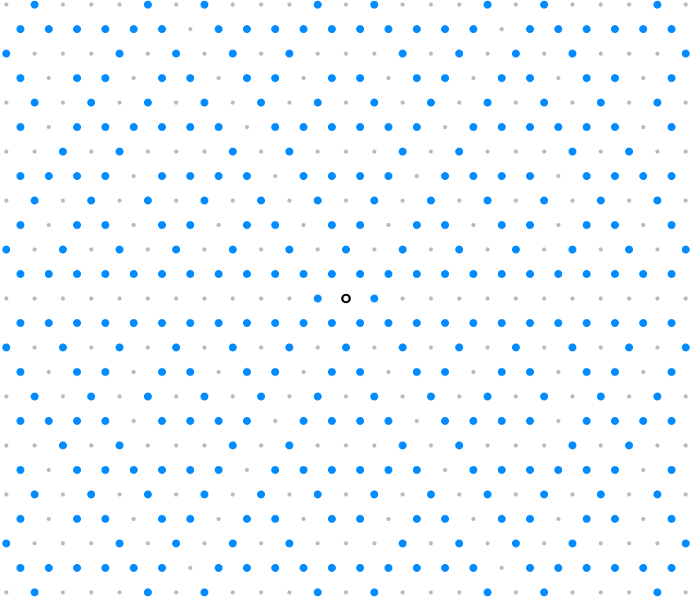

# What base 3 hides

Base 2 lives on the square lattice, and the constant buried in its arithmetic is pi: two random integers are coprime with density `6/pi^2 = 1/zeta(2)`. Ask the same question in base 3 and the answer is not pi. Base 3 brings 3-fold symmetry, and a lattice with 3-fold symmetry is forced to be hexagonal; its arithmetic is the ring of Eisenstein integers, and the constant that falls out is built from an L-value in the same family as Catalan's constant - a number with no known closed form in terms of pi. Base 2 hid something elementary; base 3 hides something genuinely deeper.

## The trap: visibility is base-blind

There is a wrong way to look for the base-3 constant, and it is worth naming. A lattice point `(a, b)` is visible from the origin exactly when `gcd(a, b) = 1` - a condition on the coordinates alone, indifferent to whether those coordinates draw a square grid or a hexagonal one. The density of visible points is `1/zeta(2) = 6/pi^2 = 0.607927...` on *any* rank-2 lattice. Counting on a `3000 x 3000` grid gives `0.608042` (**Verified**, `lab/py/eisenstein-visibility`). So simply re-running a base-2 construction with base-3 tiles returns pi again: the grid lines have not moved. The base-3 difference has to come from the number theory that is native to base 3, not from repeating the base-2 experiment.



The hexagonal lattice with its visible points marked; the faint points are hidden behind a nearer one. The density of marked points tends to `6/pi^2` here just as on the square grid - the shape of the lattice does not enter. The figure is drawn by `lab/py/eisenstein-visibility`.

## Fresh structure per level

One thing base 3 does change is exact and easy. Refine the unit interval by a base: level `level` places nodes at `k/base^level` for an integer `k`. The nodes that are new at level `level` - not already present at level `level - 1` - are those where the base does not divide `k`, and there are `base^level - base^(level-1)` of them. The fraction of fresh structure per level is therefore `(base-1)/base`: base 2 refreshes `1/2`, base 3 refreshes `2/3`, base 5 refreshes `4/5`. When the base is prime this count is exactly Euler's totient `phi(base^level)` - the same function that makes primes the maximally novel scales. Higher base injects more new resonance per level, and that is a theorem, not a measurement (**Proved**; `lab/py/eisenstein-visibility` checks `base^level - base^(level-1)` against `phi(base^level)` at bases 2, 3, 5 and the base-6 counterexample).

## The base-3 constant

A lattice with 3-fold symmetry is forced to be hexagonal - 6-fold in fact, since every lattice is centrally symmetric - and its arithmetic is the Eisenstein integers `Z[omega]`, `omega = e^(2 pi i / 3)`, with norm `N(a + b omega) = a^2 - a b + b^2`. This ring has unique factorization, so coprimality makes sense in it, and the density of coprime pairs of Eisenstein integers is `1/zeta_K(2)`, where `zeta_K` is the Dedekind zeta function of the field `K = Q(sqrt(-3))`. That zeta function splits into familiar pieces:

```
zeta_K(s) = zeta(s) * L(s, chi_-3)
chi_-3(n) = +1 if n = 1 mod 3, -1 if n = 2 mod 3, 0 if 3 divides n
```

Every number below is computed at 60-digit working precision via the Hurwitz zeta (trigamma) form in `lab/py/eisenstein-visibility` and cross-checked there by an independent route: the direct Dirichlet series for the L-value, and for `zeta_K(2)` the raw lattice sum `(1/6) * sum 1/N(z)^2` over all nonzero Eisenstein integers, which reproduces the product `zeta(2) * L(2, chi_-3)` to ten digits. **Verified.**

| constant | value | role |
|---|---|---|
| `zeta(2) = pi^2/6` | 1.644934066848226 | the base-2 story: elementary, a pi-power |
| `L(2, chi_-3)` | 0.781302412896486 | the base-3 L-value: no known closed form |
| `zeta_K(2)`, `K = Q(sqrt(-3))` | 1.285190955484149 | product of the two rows above |
| `1/zeta_K(2)` | 0.778094489175179 | density of coprime Eisenstein pairs |
| Catalan `G = L(2, chi_-4)` | 0.915965594177219 | the square-lattice sibling |
| `1/(zeta(2) * G)` | 0.663700804613853 | density of coprime Gaussian pairs |

The density claim is not left to analogy. Running the Euclidean algorithm in `Z[omega]` - nearest-integer division under the hexagonal norm - on 400,000 seeded random pairs gives a coprime fraction of `0.77809`, against the predicted `0.778094` (**Verified**, `lab/py/eisenstein-visibility`; another seed moves the fifth decimal by about `7e-4`). The constant is really there in the lattice, sieved, not asserted.

## Not a power of pi

Is `L(2, chi_-3)` secretly a pi-power, the way `zeta(2) = pi^2/6` is? Everything points the other way. The natural candidate is a rational multiple of `pi^2/sqrt(3)`, and an integer-relation search finds none: the continued fraction of `L(2, chi_-3) * sqrt(3) / pi^2` runs on with ordinary partial quotients, ruling out every rational with denominator below `10^11`; the last convergent denominator reached is `1805284405980`. For comparison, the same test applied to `zeta(2)/pi^2` terminates instantly at `1/6` (**Verified**, `lab/py/eisenstein-visibility`).

There is a structural reason to expect this. The character `chi_-3` is *odd* (`chi(-1) = -1`), and for odd characters it is the even-argument L-values that resist closed forms - the same parity barrier behind `zeta(3)`, which has no known `pi^3` form. The exact sibling of our constant is Catalan's constant `G = L(2, chi_-4) = 0.915965...`, one of the famous unresolved constants of analysis: not known to be a pi-power, not even proven irrational. `L(2, chi_-3)` sits in the same class; its one known relative is Gieseking's constant, via `L(2, chi_-3) = (4/(3*sqrt(3))) * Cl2(pi/3)` with `Cl2(pi/3) = 1.0149416064...`.

To be precise about the strength of the claim: no search can *prove* a closed form absent, and no impossibility proof is known. What is true is that none is known, none is expected, and any candidate relation now has to clear a very high bar.

## Catalan prices every base-2 design

Catalan's constant is not only the square lattice's coprimality companion in the table above; it prices the lattice energy of every base-2 design at once. Give a 2D design its four parity indicators `a_ee, a_eo, a_oe, a_oo` - which corners of the parity square are filled - and sum `(i^2 + j^2)^(-s)` over the nonzero lattice points whose parity class is filled. With `t = 2^(-s)` and `Re(s) > 1`:

```
Z_c(s) = 4 * zeta(s) * beta(s) * Q_c(t)
Q_c(t) = a_ee * t^2 + a_oo * t * (1 - t) + (a_eo + a_oe) * (1 - t)/2
```

The full-lattice factor `4 * zeta(s) * beta(s)` is classical - Jacobi's two-square theorem summed, a lattice-sum identity going back to Lorenz and Hardy - and parity-restricted lattice sums evaluating in `zeta` and `beta` are classical too (Zucker 1974; Borwein et al., *Lattice Sums Then and Now*). What is local here is the per-design polynomial `Q_c`, pinned by three exact shell relations: doubling gives `S_ee = t^2 * S`; the 45-degree rotation `(i, j) -> ((i+j)/2, (i-j)/2)` maps odd-odd pairs bijectively onto mixed-parity pairs while halving the norm, giving `S_oo = t * S_mix`; and the coordinate swap gives `S_eo = S_oe`. **Proved**; `lab/py/shell-energies` checks them as integer identities on the Dirichlet coefficients to norm `n = 200000`, the rotation bijective on 4716 odd-odd points to `n = 6000`, and against truncated lattice sums for all fifteen nonempty designs, worst gap `9.4e-10` at `s = 2`; `lab/py/gaussian-zeta` repeats the check from shell counts to `n = 1000000` at lattice radius `6000`, worst gap `1.2e-13`.

At `s = 2`, `t = 1/4` and `4 * zeta(2) * beta(2) = (2/3) * pi^2 * G`, so

```
Z_c(2) / (pi^2 * G) = (a_ee + 3*a_oo + 6*a_eo + 6*a_oe) / 24
```

a positive rational for every nonempty design - fifteen designs, fifteen small rationals from `1/24` to `2/3`. The design that draws the Sierpinski triangle at base 2 - code 7, corners `(0,0)`, `(0,1)`, `(1,0)` - gives `13 * pi^2 * G / 24 = 4.8967847822`, with `G` as in the table above. Every nonempty base-2 design's energy at `s = 2` is a rational multiple of `pi^2` times Catalan. **Proved**; `lab/py/gaussian-zeta` evaluates all fifteen rationals and the code-7 value against truncated lattice sums.

The dimensions sort themselves the way this page has come to expect:

- **3D.** The parity classes are still pinned by `n mod 8` (**Conjecture**; the check to `n = 6000` has no generator in `lab/`), but `sum r_3(n) * n^(-s)` has no Euler product and no known factorisation into standard L-functions - `r_3` is tied to class numbers - so no analogue of `4 * zeta * beta` exists to restrict. That is the absence of a known mechanism, not a proved impossibility.
- **4D.** Grade `Z^4` by the count of odd coordinates and Jacobi's four-square formula decomposes the energy of every one of the 65536 4D designs. The sum converges only for `Re(s) > 2`, so `s = 2` is out of reach; Catalan enters at `s = 3` through the factor `beta(s) * beta(s-1)`, with `beta(3) * beta(2) = pi^3 * G / 32`. Its coefficient in a design's energy is `n_1 - n_3` - filled corners with one odd coordinate minus those with three - so exactly the designs with `n_1 = n_3` are *Catalan-blind*: 17920 of 65536, which is `C(8,4) * 2^8`. The identity and the count are **Proved**; the check to `n = 2400` and the exhaustive blind census have no generator in `lab/`, so as computations they are **Conjecture**.

So Catalan sits at `s = 2` in 2D, disappears in 3D for want of a factorisation, and returns at `s = 3` in 4D - present for most designs and cancelled exactly for a counted subfamily.

## Base picks the field

The two cases line up into one rule. The base selects a lattice symmetry, the symmetry selects an imaginary quadratic field, and the field's Dedekind zeta is the hidden constant.

| base | lattice | ring | field | hidden constant |
|---|---|---|---|---|
| 2 | square (4-fold) | `Z[i]` | `Q(i)` | pi via `6/pi^2`; Catalan at `s = 2` |
| 3 | hexagonal (6-fold) | `Z[omega]` | `Q(sqrt(-3))` | `L(2, chi_-3)` - Catalan-class |

The arithmetic inside each row is proved; the pairing of base with lattice is the pattern, and it comes with a built-in boundary: beyond the 2-fold symmetry every lattice has, only 4-fold and 6-fold rotations are possible - no 5-fold lattice exists, so there is no lattice for base 5 to live on. Whatever base 5 hides, it is not found this way - which is its own kind of answer.

> Base 2 hid pi. Base 3 hides a Catalan-class constant, with a `sqrt(3)` riding along as the hexagonal signature. Raising the base does not give more of the same; it climbs from the elementary world of pi-powers into the genuinely unresolved arithmetic of odd L-values.

## Dependent bases collapse to one base

Every design on this tree fixes one base. Ask instead what several bases cut out at once and the first question is not which digits but which bases. Bases `base_1, base_2 >= 2` are multiplicatively dependent when `base_1^i = base_2^j` at some positive integers `i, j`, and independent otherwise. Read a base by its vector of prime exponents: `base_1^i = base_2^j` says the two vectors are parallel, so one dependence class is the set of integer points on a single ray through the origin, the primitive vector on that ray is the least base `r` in the class, and every member of the class is `r^e` for one integer `e >= 1`. Dependence is an equivalence relation, transitivity in one line: `base_1^i = base_2^j` and `base_2^k = base_3^m` give `base_1^(ik) = base_3^(jm)`. Inside one class the several-base question has an exact answer, and the answer is that the class was never several bases.

Fix a dimension `dim >= 1`, a root `r >= 2`, bases `base_i = r^(e_i)` for `i = 1..m`, and digit sets `A_i` contained in `{0, ..., base_i - 1}^dim` with `0` in every `A_i`. That zero is a hypothesis, not a convention: it is spent in the padding step below, and an explicit cell shows the theorem fails without it. Write `F(base, A)` for the design at that base on digit set `A`, and put `M = lcm(e_1, ..., e_m)` and `B = r^M`.

**The collapse theorem.** The joint set is one ordinary design in base `B`, and its digit set is its own bottom block. **Proved**; `lab/py/base-collapse`.

```
A = (F(base_1, A_1) cap ... cap F(base_m, A_m)) cap [0, B)^dim
F(base_1, A_1) cap ... cap F(base_m, A_m) = F(B, A)
card {n in [0, B^level)^dim : n in F(B, A)} = (card A)^level     every level >= 0
dimension = log card A / (M log r)                               Hausdorff and box
```

*Blocks nest.* Digit positions are counted from the units digit, so the base-`r^e` digits of a number are its base-`r` digits cut into consecutive groups of `e` starting at position `0`. Because `e_i` divides `M`, the positions `[g e_i, (g+1) e_i)` of one `base_i` digit sit inside the single interval `[h M, (h+1) M)` with `h = floor(g e_i / M)`: no `e_i`-group straddles two `M`-groups. This is the only place the exponents enter, and it forces `M`: the least modulus that every `e_i` divides is `lcm(e_1, ..., e_m)`, so the least common multiple is derived here, not chosen.

*The constraint is per block.* Each `base_i` digit of an integer `n` is therefore a function of exactly one base-`B` digit of `n`, and "every `base_i` digit lies in `A_i`" is a condition on each base-`B` digit separately with nothing carried between them. Words are read coarsest digit first here, the convention `mrlynum::memory::Rule` fixes: "a word `d_1 d_2 ... d_level` is read coarsest digit first and is accepted when every window of `k` consecutive digits is allowed". On base-`B` digits the joint constraint is that reading at width `k = 1`, memoryless, and the digits it allows are exactly `A`, the joint set below `B`.

*Padding needs the zero digit.* The `base_i` expansion of `n` stops at its top nonzero digit, while the top base-`B` digit of `n` is read with its full `M / e_i` `base_i` digits; the extra ones are zeros. So "every `base_i` digit of `n` lies in `A_i`" and "every `base_i` digit of every base-`B` digit of `n` lies in `A_i`" are the same condition exactly when `0` is in `A_i`. The hypothesis is sharp, not decoration: at `r = 2` with `base_1 = 2` on `A_1 = {1}` and `base_2 = 4` on the full digit set, the bottom block is `A = {0, 1, 3}`, and `F(4, A)` holds `4` and `5`, whose base-2 words `100` and `101` carry a digit outside `A_1` (**Verified**, `lab/py/base-collapse` verb `blocks`).

*Counting and dimension.* A point of `[0, B^level)^dim` is a `level`-digit base-`B` word in each coordinate with leading zeros allowed, and membership is one digit at a time, so the count is `(card A)^level` with no error term and no constant. On the real side the maps `x -> (x + a)/B` for `a` in `A` carry the unit cube to boxes with disjoint interiors, the open set condition holds, and the attractor has Hausdorff dimension and box dimension `log card A / log B = log card A / (M log r)`. Both readings are exact: `card A` is an integer and the exponent is `log_r(card A) / M`, which for the least base `r` of the class is rational exactly when `card A` is a power of `r`, since a primitive `r` is no perfect power and `(card A)^j = r^i` at positive integers `i, j` forces `j | i`. Both cases occur: base `4` on `{0, 1, 2}` with base `16` on the full digit set gives `r = 2`, `M = 4` and `card A = 9`, so the dimension is `log_2(9) / 4 = log_2(3) / 2` (**Verified**, `lab/py/base-collapse` verb `dim`).

Nothing in the four steps uses `dim = 1`, and nothing asks `A_i` to be a product across the `dim` axes. The regrouping moves positions inside the expansion, the same positions in every coordinate, because the base is a scalar. So `dim >= 2` is covered with no extra hypothesis and compound designs are covered along with product ones, which is exactly where a transversality budget on `dim >= 2` gives out. The hypotheses used are the whole list: one dependence class, arbitrary finite `m`, arbitrary `dim`, arbitrary digit sets each containing `0`. Across two classes the theorem says nothing at all.

The consequence is that the multiplicatively dependent part of the multi-base table holds no new object. Every dependent cell is a single design in a single base, so it already sits in the one-base catalogue this tree is written in, and the several-base bookkeeping applied to it is bookkeeping about one set described twice.

That bookkeeping is also wrong. Read the naive budget as `max(0, sum_i dimension A_i - (m - 1))`, clamped at zero because no dimension is negative; the clamp is live on the last row below, whose raw sum is `-1/12`. Even so the budget is not an upper bound on a dependent cell, and it is low on every cell below (**Refuted**, `lab/py/base-collapse` verb `dim`).

| bases and digit sets | `r` | `M` | block set `A` | exact dimension | naive budget |
|---|---|---|---|---|---|
| `4` on `{0, 1}`, `8` on `{0, 1, 2, 3}` | 2 | 6 | `{0, 1, 16, 17}` | `1/3` | `1/2 + 2/3 - 1 = 1/6` |
| `4` on `{0, 1}`, `16` on `{0, 1, 4, 5}` | 2 | 4 | `{0, 1, 4, 5}` | `1/2` | `1/2 + 1/2 - 1 = 0` |
| `9` on `{0, 1, 2}`, `27` on `{0, ..., 8}` | 3 | 6 | nine blocks | `1/3` | `1/2 + 2/3 - 1 = 1/6` |
| `4` on `{0, 1}`, `8` on `{0, 1, 2, 3}`, `16` on `{0, ..., 7}` | 2 | 12 | sixteen blocks | `1/3` | `max(0, 1/2 + 2/3 + 3/4 - 2) = 0` |

The second row is the clean failure. Its two designs are not transverse; they are the same set. The base-16 digits `0, 1, 4, 5` are exactly the base-4 words `00, 01, 10, 11`, so a base-16 digit lies in `{0, 1, 4, 5}` if and only if both of its base-4 digits lie in `{0, 1}`, and `F(16, {0, 1, 4, 5}) = F(4, {0, 1})`. The collapse agrees: `A = {0, 1, 4, 5}` is the base-16 digit set back again. A budget built on transversality prices the intersection of a set with itself at dimension `0`, and the truth is the set, of dimension `1/2`. The fourth row makes the same point with three bases: a raw sum of `-1/12`, a budget of `0`, and a truth of `1/3`.

The exact count law is checked by brute force, three checks to `10^13` on each of the four rows: every element of `F(B, A)` below `10^13` lies in every `F(b_i, A_i)`, tested digit by digit in each original base; the count of the joint set below `10^13`, obtained by enumerating the lowest-dimension original design and filtering it by the others, equals the count of `F(B, A)` below `10^13`, which with the first check gives set equality; and the joint count below `B^level` is exactly `(card A)^level` at every level with `B^level <= 10^13`, reaching `level = 7` and `16384` on row one, `level = 10` and `1048576` on row two, `level = 4` and `6561` on row three, `level = 3` and `4096` on row four (**Verified**, `lab/py/base-collapse` verb `check`, 16 s).

So the rule for several bases is to collapse first. Partition the bases into dependence classes; replace each class by the one design the theorem gives it, with its own base `r^M`, its own digit set and its exact dimension. That much is proved, together with its negative: a transversality budget applied inside a class is wrong, and low on every cell in the table. What a budget across the collapsed classes alone is worth, with `m` the number of classes and not the number of bases, is a separate question this page does not settle, since nothing here says a collapsed class behaves in a cross-class budget like an ordinary design of the same dimension (**Conjecture**). That mechanism lives in [cobham](cobham.md).
