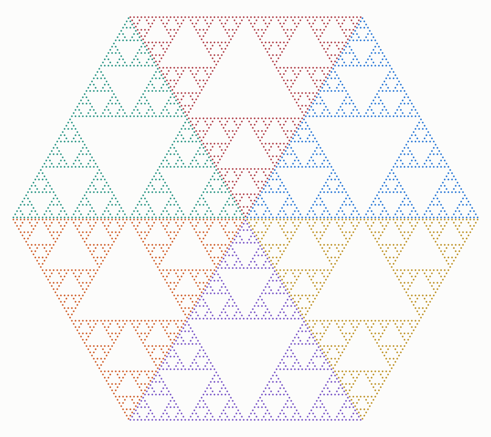

# Cuts

A parity solid is built out of cubes, so you expect a planar cut through it to look like cubes. For one design it does not. Take `mrly_bang_d3_126` - the 3D rule that keeps every corner of the parity cube except the two on the main diagonal - and cut it with the diagonal plane `x + y + z = s`. Every cut is a Sierpinski gasket, the binary digits of the height say which one, and the cut through the middle falls into six congruent gaskets tiling a hexagon.

Every claim below carries a tag. **Proved** means a proof is given or restated here; **Verified** means recomputed from scratch by a crate test or a lab study; **Conjecture** means neither. The generator is `three::diagonal` in `../crates/mrlymath`, and nothing here rests on a stored image or an earlier run. Every source named in the literature section is read live; a source that cannot be checked that way is dropped rather than repeated. The [cuts demo](../demos/cuts/) slides the plane through the solid at any level, draws the slice down the `(1,1,1)` axis one circle per cell, and reports the support, the count on the height under the cursor, the extremes and whether the profile is constant.

## The design, and what it already is

`mrly_bang_d3_126` keeps the six corners of `{0,1}^3` whose coordinates sum to `1` or `2`, dropping only `(0,0,0)` and `(1,1,1)`. Fill depends on the popcount alone, so it is an isotropic design in the sense of [the core page](core.md), the level-set `S = {1,2}`, and it is the smallest code in its symmetry class. (Verified by orbit walk over the 48 signed permutations of the cube: `mrlymath::three::diagonal` test `the_six_cut_codes_are_canonical` takes each of the six codes as the minimum of `mrlymath::bang::universe::orbit`.) Its level-`L` solid has `6^L` cubes in `8^L`, dimension `log(6)/log(2) = 2.584963`.

That solid has a name already. Centre the six substitution maps at `(1/2,1/2,1/2)` and they become `q -> (q + v)/2` with `v` running over three antipodal pairs; the linear map carrying those three vectors to `e1, e2, e3` carries all six to `+-e1, +-e2, +-e3`. That is the standard six-map, ratio-one-half **octahedron flake**, also called the Sierpinski octahedron. The Wikipedia article on n-flakes defines it exactly that way - six octahedra scaled by one half, one at each corner - and gives it dimension `log(6)/log(2)`, the number computed above. The same change of coordinates pulls the functional `x + y + z` back to the `(1,1,1)` direction in octahedron coordinates, which is a threefold axis of the octahedron. (Proved; Verified in exact integer arithmetic by `mrlymath::three::diagonal` test `the_centred_corners_are_the_octahedron_axes`, which reads the doubled matrix determinant as `-4`, so the centred basis has determinant `-1/2`, and lands all six centred corners on `+-e1, +-e2, +-e3` by Cramer.)

So the object is not new and the page does not pretend otherwise. What follows is about the cut: an octahedron seen down a threefold axis is a hexagon, which is the whole reason the middle cut has six of anything.

## Every diagonal slice is the same size

Each cube of `mrly_bang_d3_126` contributes `1` or `2` to the coordinate sum at each scale, so a point of the level-`L` solid has

```
x + y + z = sum over k < L of 2^k * d_k, d_k in {1, 2}
```

Subtract the minimum: `t = (x + y + z) - (2^L - 1) = sum of 2^k * (d_k - 1)`, with every bracket in `{0,1}`. That is an ordinary binary expansion, so it is unique. Two things follow at once. The plane `x + y + z = s` meets the solid exactly when `s = (2^L - 1) + t` with `0 <= t < 2^L`, and the digits of `t` fix the weight `d_k` at every scale. Each scale then offers exactly the `3` corners of that forced weight, so the slice has exactly `3^L` points - the same count at every admissible height. (Proved; Verified at `L = 1..8` by two enumerations that share no code path, a digit build over the `6^L` survivors bucketed by height and a plane sweep testing bit-triples, `mrlymath::three::diagonal` test `the_digit_build_pairs_with_every_slice_to_level_eight` against `slice` and `profile` at every height; test `the_slices_agree_with_a_scan_of_the_solid` runs the same pairing between `slice`, `profile` and a scan of `three::create` over four codes at two side lengths, and test `every_slice_of_one_two_six_holds_three_to_the_level` carries the support, the `3^L` count and the `6^L` total to `L = 14` on the digit polynomial `mrlymath::three::diagonal::profile`, which never builds a point set at all.)

Constant is the strong word. The slice count is `3^L` against an ambient scaling of `2^L`, so every slice has dimension `log(3)/log(2) = 1.584963`, which is exactly `log(6)/log(2) - 1`. No height is deficient; the cut never degenerates. (Proved.)

## The binary digits of the height schedule the slice

The same argument says *which* three corners are available, not just how many. At scale `k` the slice may use the three corners of weight one, `100`, `010`, `001`, when bit `k` of `t` is `0`, and the three of weight two, `011`, `101`, `110`, when it is `1`. Substituting the matching triple scale by scale builds a set with three choices at every scale - a Sierpinski gasket whose per-scale orientation sequence *is* the binary expansion of the height offset. (Proved; Verified by exact set equality for **every** offset `t` at `L = 1..6`, all 126 slices, not a sample of special heights: `mrlymath::three::diagonal` test `every_scheduled_slice_is_the_digit_gasket` against `mrlymath::three::diagonal::slice`.)

This is a known mechanism, and the statement of the novelty is in its own section below.

## Six gaskets in a hexagon

Now take the two central heights. They are `t = 2^(L-1) - 1`, whose expansion is a `0` followed by ones, and `t = 2^(L-1)`, a `1` followed by zeros. Their top scales are opposite and their lower `L - 1` scales are constant, so the schedule splits each slice into three translates of a constant-schedule gasket on `3^(L-1)` points. Six pieces in all, pairwise disjoint, three of each orientation:

```
6 * 3^(L-1) = 2 * 3^L
```

which is the whole of both slices and nothing else. (Proved as a corollary of the schedule; Verified at `L = 2..8` by rebuilding the six pieces from the level-`L-1` constant-schedule sets and checking their union against the two slices, their pairwise disjointness, and the size of each piece, `mrlymath::three::diagonal` test `the_central_union_is_six_gaskets_from_the_level_below`; the union sizes 18, 54, 162, 486, 1458, 4374, 13122 at `L = 2..8` are pinned by `mrlymath::three::diagonal` test `the_two_central_heights_carry_two_times_three_to_the_level` and the six pieces at `L = 7` by test `the_central_union_is_six_pieces_of_seven_two_nine_at_level_seven`.) The union is invariant under all six coordinate permutations and under complementing every coordinate against `2^L - 1`, an order-12 symmetry group; the complement swaps the two heights. (Verified at `L = 2..8` by `mrlymath::three::diagonal` test `the_central_union_carries_the_order_twelve_symmetry`.)



The two central cuts of `mrly_bang_d3_126` at `L = 7`, projected together along the `(1,1,1)` axis: 4374 lattice points in six gaskets of 729, one colour per piece, three pointing each way. The picture is the one the [cuts demo](../demos/cuts/) draws at level 7 with both central heights on, one circle per cell out of `mrlymath::three::diagonal::svg`; the 4374 points, the six pieces of 729 and the injectivity of the projection - no two points share the integer shadow `(x - y, x + y - 2z)` - are pinned by the crate test `the_central_union_is_six_pieces_of_seven_two_nine_at_level_seven`.

There is a second, coarser way to split the same set. Sort the union by which of the six orderings of `x, y, z` a point satisfies. The result is six classes of exactly `3^(L-1) - 1` points, plus exactly `6` points with two coordinates equal: the six permutations of `(m, m, m+1)` and `(m, m+1, m+1)` for `m = 2^(L-1) - 1`. The split is perfectly even at every level. (Verified at `L = 2..8` by `mrlymath::three::diagonal` test `the_central_union_splits_evenly_by_coordinate_order`, six classes of `3^(L-1) - 1` plus exactly 6 tied points.) An uneven count such as `244, 243, 243, 243, 243, 242` can only arise from how points on a sector boundary are assigned, not from the lattice. (Refuted.)

## The flat slice is a page of Pascal's pyramid

Set `t = 0`. Every scale then uses a weight-one corner, so each bit of the height goes to exactly one of the three coordinates: `x`, `y`, `z` have pairwise disjoint binary supports and sum to `2^L - 1`. By Kummer's theorem that is precisely the condition for the trinomial coefficient `n! / (x! y! z!)` to be odd. The lowest slice of `mrly_bang_d3_126` is therefore the odd part of layer `n = 2^L - 1` of Pascal's pyramid, which is the classical Sierpinski gasket. (Proved; Verified at `L = 1..6` against the disjoint-support test, and at `L = 1..5` against the parity of the coefficients themselves, computed as integers rather than inferred from Kummer - 3, 9, 27, 81, 243 points, `mrlymath::three::diagonal` tests `the_flat_slice_has_pairwise_disjoint_binary_supports` and `the_flat_slice_is_the_odd_layer_of_pascals_pyramid`.)

That gives the right yardstick for the constant count. Run the same argument on `mrly_bang_d3_23`, the design that keeps the corners of weight `0` or `1`: its digit triples have popcount at most one, so its whole level-`L` solid is the odd part of Pascal's pyramid, and its slice at height `s` has `3^wt(s)` points, where `wt` is the binary digit sum. That is the classical layer count. (Proved; Verified at `L = 1..6` by `mrlymath::three::diagonal` test `the_twenty_three_slices_are_three_to_the_digit_sum`, every height of the profile against `3^wt(s)`.)

Both halves of that are on record. `A268240` is Pascal's tetrahedron of trinomial coefficients read mod 2, and its comments say it "might be called Sierpinski's tetrahedron" and that the number of ones in slice `n` is `A048883(n) = 3^wt(n)`; `A048883` in turn carries the comment that it counts the odd values in layer `n` of Pascal's tetrahedron. (Verified: both entries read live from OEIS, and `A048883`'s terms `1, 3, 3, 9, 3, 9, 9, 27, ...` reproduced by `mrlymath::three::diagonal::profile` in the same test.) Eppstein's fractal-sponge page in the Geometry Junkyard lists "take *Pascal's Pyramid* of trinomial coefficients modulo two" as one of four equivalent constructions of the Sierpinski tetrahedron, stated as folklore with no proof and no slicing.

So the contrast is exact rather than rhetorical. The classical pyramid's layer count `3^wt(s)` swings between `1` and `3^L` as the height's digits change; `mrly_bang_d3_126`'s is `3^L` at every admissible height. `mrly_bang_d3_23` is the same design that draws the Menger sponge at `n = 3`, listed under carpet and net on the core page - the base decides the shape, and at base 2 it is a tetrahedron flake, four maps at ratio one half on four affinely independent corners. (Proved: 4 of 8 cells at `n = 2` by the corner rule; Verified: 20 of 27 at `n = 3`, `lab/design-census`.)

## The same page, one dimension down

What trinomials do for the pyramid, binomials do for the plane, and the 2D case closes with two OEIS identifications the 3D one already has. The 2D design of code 7 - corners `(0,0)`, `(0,1)`, `(1,0)` - has level-`L` cell set

```
{ (i, j) in [0, 2^L)^2 : i AND j = 0 }
```

since a cell survives the substitution exactly when no binary digit position holds a `1` in both coordinates. Adding `i` and `j` in base 2 produces a carry precisely at such positions, and Kummer's theorem counts carries as the 2-adic valuation of `C(i+j, i)`, so `i AND j = 0` exactly when `C(i+j, i)` is odd. The shear `(i, j) -> (i, i+j)` - unimodular, the same `GL_2(Z)` move as the shear theorem in [the coprimality spine](coprime.md) - then carries the cell set bijectively onto the odd entries of Pascal's triangle. The level-`L` set is OEIS `A047999`, "Sierpinski's triangle (or gasket): ... Pascal's triangle mod 2", and its antidiagonal population count is Gould's sequence `A001316(n) = 2^popcount(n)`, on record since Glaisher, 1899. (Proved; Verified by `lab/pascal-shear`: level sets to `L = 9` with `3^L` cells each, exact binomials for `i, j < 128`, Pascal mod 2 rebuilt from the additive recurrence alone to row 1023 with zero mismatched cells, the shear checked as a bijection, and both OEIS b-files checked term for term - 50001 terms of `A001316` against `2^popcount(n)` and all 10585 terms of `A047999`, rows `0..144`, against the recomputed triangle, no differences.)

One naming caution travels with the identification. The core page's 2D table lists *carpet* and *net* as the aliases of code 7, because at base 3 that rule keeps 8 of 9 cells and draws the Sierpinski carpet - the same base-swap that turns `mrly_bang_d3_23` from sponge to tetrahedron above. At base 2 the shape code 7 draws is the Sierpinski triangle, which is what `A047999` calls it, and what the flat slice of `mrly_bang_d3_126` reached through three dimensions two sections ago. The 8-of-9 fill at `n = 3` is the first row of the core page's own table; the `3^L` count at base 2 is the level-set verification above.

## What is new here, and what is not

Four separate things are going on, with four different statuses, and the page claims priority for none of them.

The **object** is known. `mrly_bang_d3_126` is the octahedron flake up to a linear change of coordinates, and the diagonal plane is perpendicular to one of its threefold axes; the flake and its dimension are standard, as the n-flake article records.

The **hexagon** is known as a genre. Cutting a cube-based digit fractal perpendicular to a space diagonal and finding a hexagon with unexpected sixfold structure is a well-travelled move: the Wikipedia article on the Menger sponge states that the cross-section through the centroid perpendicular to a space diagonal "is a regular hexagon punctured with hexagrams arranged in six-fold symmetry", and counts those hexagrams by the recurrence `a_n = 9*a_(n-1) - 12*a_(n-2)` with `a_0 = 1`, `a_1 = 6`, cross-referenced to OEIS `A299916` - whose own comment describes six-pointed-star holes in the hexagonal cross-section of a Menger sponge. The n-flake article adds that the projection of the Cantor cube onto the plane orthogonal to its main diagonal is a hexaflake. (Verified: all three read live; `A299916`'s listed terms `1, 6, 42, 306, 2250, ...` satisfy the stated recurrence.) Nothing on this page is the first hexagonal diagonal cut of a cube fractal.

The **mechanism** of the schedule is published, and recently. Nakajima and Watanabe, *Topology of slices through the Sierpiński tetrahedron*, `arXiv:2603.06004`, study the slice `J_c` of the Sierpinski tetrahedron at height `c`. Their Main Theorem A states that if `c` is a dyadic rational then `J_c` is a finite disjoint union of copies of the Sierpinski gasket, and they get there by realising each slice as the limit set of a non-autonomous iterated function system *determined by the binary expansion of the height*: their scale-`j` index set is `{1}` when digit `j` is `0` and `{1,2,3}` when it is `1`. That a base-2 cube fractal cut at a dyadic height is gasket-shaped, with the per-scale map choice read off the digits of the height, is therefore literature. (Verified: abstract, Definition 1.2, Main Theorems A and B and the index-set definition read live.)

The **arithmetic framing** is classical, as the Pascal's pyramid section says.

What is left, and what this page actually asserts, is the shape the phenomenon takes for this design. Nakajima and Watanabe's digit changes the *number* of maps, so their slice count varies - their Main Theorem B gives `3^(n-l)` components, `l` the number of zero digits - and at every non-dyadic height their slice is totally disconnected. Here the two options are the weight-one triple and the weight-two triple, both of size three, so the digit flips the *orientation* of the simplex and never the count: every admissible height gives a single gasket of exactly `3^L` points, with no exceptional heights and no disjoint union. That constancy is what makes the six-gasket decomposition of the middle cut possible at all.

The literature pass behind the sources above finds that combination in nothing it opens, and finds the design itself under no name. That is a report on a search, not a theorem, and no search of this kind is exhaustive; the dimension theory of slices of self-similar sets with cubic patterns in particular is a mature literature this page has not read and deliberately makes no claim against. The mathematics above stands on its proofs and its recomputation. The question of priority is open and is left open.

## The ladder in D dimensions

The sections above walk one diagonal cut down a dimension. It walks up as well, and the walk has a theorem. Fix the base at 3 and let the design in dimension `D` keep every cell with at most one coordinate equal to the middle digit - the Menger rule read dimension by dimension, which is the carpet at `D = 2` and the sponge at `D = 3`. Cut at the central diagonal height `Sum_i x_i = D(3^L - 1)/2` and count filled cells: `a_D(L)`.

The digit polynomial factors, and that factorisation is the whole mechanism:

```
P(t) = Sum_(v in F) t^(v_1 + ... + v_D) = (1 + t^2)^(D-1) (1 + D t + t^2) .
```

A tuple with no middle coordinate contributes `(1 + t^2)^D`; a tuple with exactly one, in any of `D` places, contributes `D t (1 + t^2)^(D-1)`. (**Proved**; the level-1 count it predicts is enumerated over all `3^D` digit vectors at `D = 2..14` by `lab/slice-ladder-controls`.)

**Theorem** (Conjecture R, the name [slices](slices.md) uses for it)**.** `a_D(L)` satisfies a linear recurrence with constant coefficients of order exactly `ceil(D/2)`.

Three ingredients. The central slice count is the centre coefficient of `Prod_(j=0)^(L-1) P(t^(3^j))`, computed by a carry automaton with integer state `c` and transition `c' = (c + D - s)/3` over digit sums `s` weighted by `P[s]`, so `a_D(L) = (M^L)_(0,0)`. First, the states reachable from `c = 0` are exactly `{c : |c| <= floor((D-1)/2)}`: the map `x -> (x + D)/3` contracts to the fixed point `D/2` and carries are integers, and every intermediate carry is attained because `P[s] > 0` for several `s` in each residue class. Second, the design is invariant under `v -> (2,...,2) - v`, so `P[s] = P[2D - s]`, the reflection `c -> -c` commutes with `M`, and `e_0` is fixed by it - the Krylov subspace from `e_0` lies in the `+1` eigenspace, whose basis `{e_0, e_1 + e_(-1), ..., e_m + e_(-m)}` with `m = floor((D-1)/2)` has dimension `floor((D-1)/2) + 1 = ceil(D/2)`. That is the upper bound, **Proved** for every `D`. Third, exactness: the even-restricted transfer matrix `M_even`, of size `ceil(D/2)`, has distinct eigenvalues, hence is non-derogatory, hence the Krylov subspace is the whole even space. **Conjecture** for all `D`, with the distinct-eigenvalue check at `D = 2..14` and a minimum eigenvalue gap above 6.9 carrying no generator - this is **Conjecture R**, the name the rest of the tree cites it by ([slices](slices.md)), and the missing statement is that this explicit `ceil(D/2) x ceil(D/2)` integer matrix family has square-free characteristic polynomial. Conjecture R is about the ORDER of the recurrence and nothing else; the sign law on the same `M_even`, Conjecture S, is owned by [spectra](spectra.md) and is not stated here. Corollary: the slice dimension is `log_3(rho_D)` with `rho_D` the dominant root of an integer polynomial of degree `ceil(D/2)`.

The two rungs this page already knows are the controls, and they pass. `D = 2` gives `2^L`, order 1 - the carpet's central diagonal cut carries the middle-thirds Cantor dimension `log_3 2`. `D = 3` gives `6, 42, 306, 2250, 16578, 122202` with `a(L) = 9a(L-1) - 12a(L-2)`, order 2, which is the `A299916` recurrence this page records above from the Menger sponge's hexagonal cross-section, reached here by a route that never mentions a hexagon. Above that the rungs are new numbers: `D = 4` gives `6, 132, 1848, 29040, 441408, 6772128` with `a(L) = 11a(L-1) + 66a(L-2)`, dominant root `(11 + sqrt(385))/2`; `D = 5` gives `30, 1000, 35700, 1321600, 49786200` and `D = 6` gives `20, 4030, 242300, 24642700`, both order 3. (**Verified** for `D = 3` by `mrlymath::six::topology` test `the_carpet_slice_percolates_at_base_three` and by `lab/slice-coprimality`, and for `D = 4` by `lab/slice-ladder-controls`, which prints the census at levels 1..6, fits the order-2 recurrence on the first four terms and checks it on all six; **Conjecture** for the `D = 5` and `D = 6` ladders and the minimal orders `3, 3`, which no lab study regenerates.)

**The ladder starts on a polytope, not on an analogy.** The hyperplane `Sum_i x_i = D(3^L - 1)/2` cuts the `D`-cube in its central cross-section, a hypersimplex: a segment at `D = 2`, the regular hexagon at `D = 3`, the regular octahedron at `D = 4`, a 30-vertex 4-polytope at `D = 5`, a 20-vertex hypersimplex at `D = 6`. Its vertex count is `C(D, D/2)` for even `D` and `C(D, (D-1)/2)(D+1)/2` for odd `D`, giving `2, 6, 6, 30, 20, 140, 70` at `D = 2..8`. The level-1 slice IS that vertex set - **Verified** for `D = 2..14` with zero mismatches by `lab/slice-ladder-controls`, which enumerates the slice side over all `3^D` digit vectors and computes the vertex side as a binomial, so the two sides share no formula. So `a_D(1)` is a closed binomial before any recurrence is asked for, and the `D = 2` and `D = 3` controls above are the polytope's first two rungs.

The same `M_even` carries a second question, on its dominant root rather than its degree: how `log_3(rho_D) - (D-1)` behaves as `D` grows. That is the base ladder's neighbour and it lives in [spectra](spectra.md); the matrix is defined here and should not be redefined there. That question is Conjecture S, `sgn(log_3(rho_D) - (D-1)) = (-1)^(D+1)`, Verified to `D = 100` on [spectra](spectra.md) and unproved. This page carries the order law and nothing about the sign; no count or recurrence below is evidence either way.

What is and is not new here, stated as flatly as the section above states it for `D = 3`. The `D = 4` object is not new - Hocking, *Bridges* 2023, cuts four-dimensional Menger sponges on the diagonal, and this tree already records that his paper carries no count and no sequence ([DISCOVERIES](DISCOVERIES.md), the grey-literature line, where his full text is searched for `306`, `2250` and `A299916` with no hit; the paper itself is in [REFS](REFS.md)). The counts, the recurrences and the order law are this tree's. The order law is the part worth taking outside: it says the dimension of the maximally arithmetic exceptional plane is an algebraic number of degree at most `ceil(D/2)`, in every dimension at once.

## The neighbours

The other four designs whose diagonal cuts are rendered, at `L = 4`. Support is the interval of heights the plane meets at all; the next column counts how many heights inside that interval are actually non-empty. (Verified by `mrlymath::three::diagonal` test `the_neighbours_profile_at_level_four`, which reads every column off `profile` and `support`; the level-`L` sets and profiles are rebuilt from the corner rules, and all five codes are already canonical.)

| design | rule | support | non-empty | min | max | constant |
|---|---|---|---|---|---|---|
| `mrly_bang_d3_63` | `x and y = 0` | `[0,30]` | 31 of 31 | 1 | 81 | no |
| `mrly_bang_d3_105` | popcount even | `[0,30]` | 16 of 31 | 1 | 81 | no |
| `mrly_bang_d3_111` | drops `(1,0,0)` and `(1,1,1)` | `[0,30]` | 31 of 31 | 1 | 111 | no |
| `mrly_bang_d3_126` | popcount in `{1,2}` | `[15,30]` | 16 of 16 | 81 | 81 | **yes** |
| `mrly_bang_d3_127` | `x and y and z = 0` | `[0,30]` | 31 of 31 | 1 | 162 | no |

`mrly_bang_d3_126` is the only one of the five with a flat profile, and the only one whose support is a proper sub-interval reached at full strength. `mrly_bang_d3_105`, one of the six self-complementary 3D classes on the core page, is the opposite extreme: it meets only the even heights, so half its planes miss entirely.

One refutation belongs here. The closed form `4*(L+5)*3^(L-1)` for `mrly_bang_d3_127`'s diagonal cut gives 24, 84, 288, 972, 3240, 10692 at `L = 1..6`, while that design's actual slice maxima are 3, 12, 45, 162, 594, 2187, its minima are `1` at every level, and its totals are `7^L`. The form matches the maximum, the minimum and the total at no level at all, and is not used anywhere on this page. (Refuted; Verified at `L = 1..6` by `mrlymath::three::diagonal` test `the_one_two_seven_cut_matches_no_closed_form`.)

## Where the numbers live

`mrlymath::three::diagonal` carries the cut itself. `profile` is the digit polynomial, so a height is counted without a cell being built; `slice` enumerates the lattice points of one plane; `project` and `shadow` send a point down the `(1,1,1)` axis in floating point and in integers; `svg` draws a set of heights, one circle per cell. `mrlyweb`'s `diagonal_profile`, `diagonal_count` and `diagonal_svg` put all four in the browser behind the cuts demo. The module's tests pin the support and the constant count to `L = 14`, the scheduled gasket for all 126 slices, the central totals and the coordinate-order split to `L = 8`, the six pieces of 729 and the injective projection at `L = 7`, the odd-trinomial layer, the `A048883` calibration, the neighbour table, the refutation and the exact octahedron conjugation.

`three::diagonal` in `../crates/mrlymath` computes every number above, its tests named for the claims they pin, and the cuts demo draws the slices and the figure; `lab/pascal-shear` owns the 2D section and `lab/slice-ladder-controls` the ladder. Sequences that come out of this construction are held to the standard set in [the sequence ledger](sequences.md).
