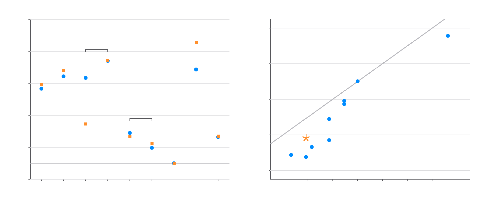

# The walk dimension

Every page before this one weighs a design: the fractal dimension `d_f = log(fill)/log(q)` says how fast mass accumulates with scale, and the fill law makes it exact. This page listens to a design instead. Drop a random walker on the graph of a pattern - one node per filled cell, one edge per face-adjacent pair - and watch it spread: `MSD(t) ~ t^(2/d_w)`. On any solid grid the walk dimension `d_w` is 2. On a fractal the walker keeps hitting holes at every scale and `d_w > 2`: distance costs more time than it should. The pair `(d_f, d_w)` fixes the spectral dimension `d_s = 2*d_f/d_w`, which is how the low Laplacian spectrum - the density of the shape's slow modes, its music - scales.

The question this page answers by census: **does the mass fix the music?** Two designs with the same fill draw fractals of the same dimension, the same density at every level, the same fill polynomial degree. Do they walk the same? They do not, and the failure is exhibited three different ways.

Every claim carries a tag. **Proved** means a proof is given or restated here; **Verified** means recomputed from scratch by a lab study; **Conjecture** means neither. The generator is `lab/walk-dimension`, which also draws the figure. The [race demo](../demos/race.html) runs the experiment live: two base-3 designs of the same fill, random walkers on both at once.

## The method, and what gates it

Two readings, no shared method, both anchor-gated - the census aborts if the gates fail.

- The spectral reading builds patterns by Kronecker power and reads `d_w` off eigenvalue level ratios: on a self-similar graph the low Laplacian eigenvalues scale by a fixed time factor per level, so `lambda_k(L)/lambda_k(L+1) -> q^(d_w)`. Level pairs 4 to 5 in 2D, 3 to 4 in 3D (160000 nodes), modes `k = 1..4`, with the previous level pair kept as the drift bar. Eigenvalues are dense through faer up to 2000 nodes and above that a block Krylov Rayleigh-Ritz projection through a projected conjugate gradient.
- The walker reading builds patterns from the digit rule, finds components by its own BFS, and runs 20000 seeded blind-ant walkers, fitting `MSD(t)` in a window kept clear of the lattice scale and the truncation walls. The walker digits depend on the random stream; the values printed here are the lab stream's, and every gate passes on it.

Three anchors, all passing in both readings. (**Verified**, `lab/walk-dimension`.)

| anchor | exact value | spectral route | walker route |
|---|---|---|---|
| solid grid | `d_w = 2`; `lambda_2 = 2 - 2*cos(pi/n)` | machine-exact `lambda_2`; `d_w = 1.99990` | `d_w = 2.0035` |
| the path drawn by code 7 | `d_w = 2`; same closed form | machine-exact; `d_w = 1.99999` | `d_w = 2.0094` |
| corner-glued Sierpinski gasket | `tau = 5`, `d_w = log(5)/log(2) = 2.321928` | ratios `4.9973, 4.9973, 4.9945, 4.9972` at levels 7 to 8 | `d_w = 2.3590` (1.60%) |

The gasket values are exact by spectral decimation (Rammal-Toulouse); the solid and path closed forms are the classical tridiagonal spectrum. (**Proved**, classical; the gate measurements **Verified**.)

## Who can walk at all

A walker needs somewhere to go. Of the 26 base-3 classes ([the bijection page](bijection.md) counts them; the orbit walk is re-run here and agrees, 26 classes of the 72-element wreath group with orbits summing to 512), the representatives that sustain a spanning single component at level 5 are 79, 95, 127, 239, 255 and 511. The other representatives crumble - the giant component's share of the pattern falls with level (rep 15: 0.42 at `L = 4`, 0.32 at `L = 5`; rep 31: 0.22 then 0.13; the rest are already dust). The walking minority is the census. (**Verified**, all 26 representatives at `L = 4` and `L = 5`, `lab/walk-dimension`.)

**Spanning is not a class invariant.** Testing one representative per class is sound for `d_f`, the fill polynomial and every other quantity on this page, because the toroidal group preserves them. It is not sound for spanning: the group wraps residues, so it does not preserve which cells touch a wall. Counted over codes rather than representatives, exactly **95 of the 511** non-empty codes have a giant component touching all four walls at level 5, and they fall in **seven** classes; only **83 codes in six classes** - 79, 95, 127, 239, 255, 511 - are a single spanning component, so the two units of count differ. The extra class is that of rep 238 (fill 6, size 6): 238 itself crumbles - 1556 components at `L = 5`, giant share 0.0312 - while its classmates 245, 350, 371 and 413 also carry 1556 components at `L = 5`, the level-1 tile being already 4-disconnected, with giant share 0.0624, and it is their giant component alone that touches all four walls; 427 crumbles like 238. This is the same "wrap caveat" the next section records, arriving one section early. The census below is unaffected - it is a census of named designs, not of classes - but "exactly six classes" is the wrong unit for the 95. (**Verified**, all 511 codes at `L = 5`, `lab/walk-dimension`.) A conduction sweep gives those four `spans_x = spans_y = 1` with `fom_iso` 0.387097, 0.141732, 0.065060, 0.031665, 0.015694, 0.007824 at `L = 1..6`, and a drumhead sweep gives them `caps = 1` with `r1` 0.841650, 0.466162, 0.386839, 0.364230 at `L = 1..4`, against `fom_iso = 0` and `caps = 0` for 238 and 427 at every level; no lab study regenerates those sweeps. (**Conjecture**.)

## The census

Spectral `d_w` from the `lambda_2` ratio at levels 4 to 5; walker `d_w` from MSD; `d_s` by the Einstein relation from the walker value. (**Verified**, both readings, `lab/walk-dimension`, agreement within 1.6% outside the two flagged rows; `d_s = 2*d_f/d_w` is used here as the working definition of `d_s`, which is a theorem for the classical carpets and gasket and a definition elsewhere.)

| design | fill | `d_f` | `d_w` spectral | `d_w` walkers | `d_s` |
|---|---:|---|---|---|---|
| `mrly_bang_d2_q3_79` | 5 | 1.4650 | 2.466 | 2.494 | 1.17 |
| `mrly_bang_d2_q3_95` | 6 | 1.6309 | 2.543 | 2.582 | 1.26 |
| `mrly_bang_d2_q3_127` | 7 | 1.7712 | two branches - see below | 2.245 | 1.58 |
| `mrly_bang_d2_q3_239` | 7 | 1.7712 | 2.640 | 2.643 | 1.34 |
| `mrly_bang_d2_q3_255` | 8 | 1.8928 | 2.190 | 2.167 | 1.75 |
| `mrly_bang_d2_q3_495` (carpet) | 8 | 1.8928 | 2.097 | 2.124 | 1.78 to 1.81 |
| `mrly_bang_d2_q3_511` (solid) | 9 | 2.0000 | 2.000 | 1.998 | 2.00 |
| `mrly_bang_d2_7` | 3 of 4 | 1.5850 | 2.586 | 2.755 (drifting) | 1.15 to 1.23 |
| `mrly_bang_d3_q3_23` (sponge) | 20 | 2.7268 | 2.164 | 2.169 | 2.51 to 2.52 |

The spectral column is the `lambda_2` reading throughout; the means over modes `k = 1..4` for reps 79 and 95 are 2.4667 and 2.5452. The walker column is reproducible to about 0.01 across random streams; the spectral column to every printed digit.

The carpet row lands where the literature points: rigorous carpet analysis is Barlow-Bass, and the accepted numerics sit near `d_w ~ 2.10`, `d_s ~ 1.80` - measured here as 2.097 to 2.124 and 1.78 to 1.81 without tuning anything. (**Verified** against stated literature values, not re-derived.)

## Finding one: same mass, different music

Codes 127 and 239 share fill 7, hence `d_f = log(7)/log(3) = 1.7712` exactly, identical density at every level, identical leading fill behaviour. Their bulk walk dimensions separate by `~0.39` - 2.25 against 2.64 - with both readings agreeing on each side and every drift bar an order of magnitude smaller than the gap. The spectral dimensions land at 1.58 against 1.34: same mass, different music, and not by a little. (**Verified**, `lab/walk-dimension`.) The fractal dimension does not determine the walk dimension, exhibited inside one fill class of one base - the walk analogue of what [the complexity page](complexity.md) shows for Boolean measures at `D = 4`.

The same split appears across constructions: the base-2 3-of-4 design and the corner-glued gasket share `d_f = log(3)/log(2)` and separate cleanly in `d_w` - 2.59 measured against 2.3219 exact. (**Verified**; the gasket side is **Proved**, classical.)

## Finding two: the wrap caveat turns physical

Codes 255 and 495 are one symmetry class - the base-3 group wraps residues, so the carpet (centre hole) and the corner-hole design sit in one orbit, as [the bijection page](bijection.md)'s census counts them. Their truncations walk differently: 2.17 to 2.19 against 2.10 to 2.12, stable across two level pairs in both readings. The residue rotation is a symmetry of the rule, not of the drawn pattern, and the walker feels the difference the fixed-`n` caveat of [the core](core.md) has always recorded for fill counts. (**Verified**, `lab/walk-dimension`.)

**The two are not one shape, and the separation needs no limit argument to explain it.** Under the symmetry group of the *drawn* pattern - the dihedral group of the square - 495 is an orbit of size one, the centre-hole carpet, while 255 sits in `{255, 447, 507, 510}`, the corner-hole tiles. No rotation or reflection carries one to the other. The 9-member toroidal class `{255, 383, 447, 479, 495, 503, 507, 509, 510}` is exactly the union of three physically distinct dihedral orbits. (**Proved**, by listing the orbits.) Two sweeps separate them hard on every observable: a drumhead sweep splits the nine fill-8 codes into `{495}` at `r1` 1.108058, 1.075820, 1.017770, 0.960365, `{383, 479, 503, 509}` at 0.978010, 0.912888, 0.844316, 0.786655, and `{255, 447, 507, 510}` at 0.962769, 0.858300, 0.757199, 0.675372; a conduction sweep puts 255 against 495 at `fom_iso` 0.845610 versus 0.803571 at `L = 1` and 0.288823 versus 0.458852 at `L = 6`, a 59% gap. No lab study regenerates those sweeps. (**Conjecture**.) So the `d_w` split is two different shapes measured separately, which is the expected outcome, not a puzzle about infinite volume. What remains genuinely open is only the narrow version: whether the *rule*-level identification says anything about the limits at all.

## Finding three: one design, two exponents

Code 127 refuses to be one number. Its low eigenvalue ratios split into two stable branches - modes 1 and 2 scale with exponent near 2.53, modes 3 and 4 with 2.20 to 2.29 - at both level pairs, while the walkers side with the fast branch at 2.245. The spectral drift on that branch is 0.004; the walker drift is stream-dependent, 0.028 on the lab stream, where the carpet is the cleanest fit of the census at 0.0005. The slow mode is localized: its eigenvector's weight sits in the sub-block hanging from tile cell `(2,0)`. The design is a two-row body with a flap at every scale, and its slowest relaxation is a flap breathing through a neck, not bulk diffusion. (**Verified**, `lab/walk-dimension`: branches at two level pairs, localization read off the eigenvector.) Read as a spectrum of exponents - bulk transport near 2.25, a pendant-mode family near 2.53 - with persistence in the limit open. (**Conjecture**.)

## Music never beats mass

Every subject measures `d_w >= 2`, equivalently `d_s <= d_f`, with the solid attaining equality. A design can only slow a walker down, never speed it up past free diffusion - holes at every scale are obstacles, whatever else they are. (**Verified** across the census; stated as measurement, not theorem - the general inequality for this family is not proved here.)

## Where the honest line falls

Everything here is finite-level measurement. The scaling windows reach side 243 in 2D (level pair 4 to 5) and side 81 in 3D; the base-2 subject's walker estimate is still drifting at side 256 and its spectral value is the one to quote; heat-trace and staircase estimators carry a known finite-size bias (about 5% low on the solid, where the answer is 2 exactly; **Conjecture**, no lab study regenerates that figure) and serve only as consistency checks. The Einstein relation is imported as a definition of `d_s` outside the classical cases. No claim on this page is a limit theorem, and the two open questions - the class split's fate and 127's second exponent - are tagged as such. Readings, gates, census table and figure: `lab/walk-dimension`, about six minutes.

> Weigh two shapes and the scale reads the same; drop a walker on each and one of them is twice as far from home. The mass is one number. The music is another.
